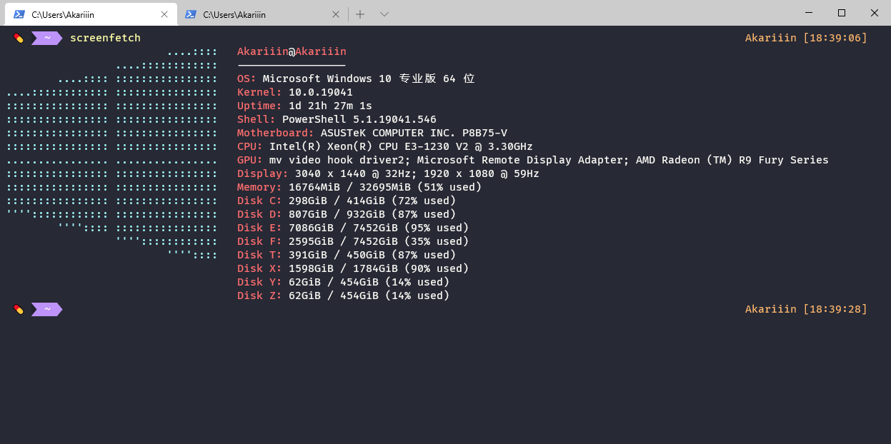
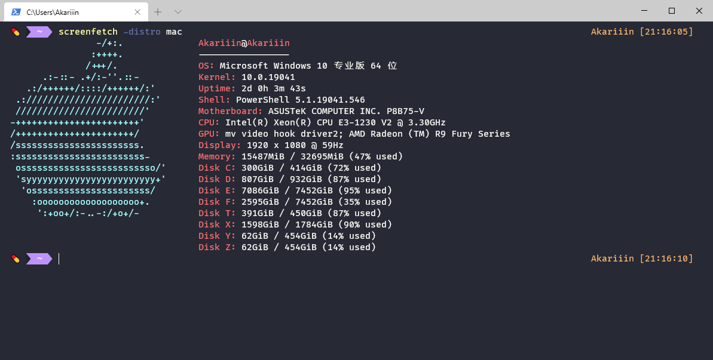

# Windows screenFetch

_Original by [JulianChow94](https://github.com/JulianChow94/Windows-screenFetch), modified in this repo._



## ScreenFetch

screenFetch was originally made as a "Bash Screenshot Information Tool". Simply, it lets you display detailed information about your system in the terminal, it also comes with a ASCII logo for the detected Linux distribution.

This doesn't work on Windows natively and this project is my attempt to provide a solution that does not require obtaining a linux environment on windows.

The original can be found in [KittyKatt's repository](https://github.com/KittyKatt/screenFetch).

## How is it different

The original screenfetch requires a system that supports bash so it cannot be used on windows natively! This is a small scale project that simply "mimics" the behaviour of screenFetch in windows.

**Windows screenFetch is a Powershell script, not a Bash program**. Therefore, a linux-like environment such as [Cygwin](https://www.cygwin.com/) or [MinGW](http://www.mingw.org/wiki/msys) is ***not required***. This can be run natively on windows as a Powershell script within a Powershell or command prompt console.

*Since this tool is only intended to run within a windows environment, no flags to invoke any Linux distribution ASCII art is supported.*

## Installation

- ### Git clone

#### Step 1. Go to `Modules` directory in PowerShell path

Run following command to check path

```powershell
$env:PSModulePath -Split ";"
```

It is recommended to use defaule `$PROFILE` directory, you need to create one if not exists

```powershell
$UsePath = (Split-Path $PROFILE | Join-Path -ChildPath Modules); if(!(Test-Path $UsePath)) {New-Item $UsePath -Type Directory -Force | Out-Null}
Set-Location (Split-Path $PROFILE | Join-Path -ChildPath Modules)
```

#### Step 2. Clone this repository

Git command is available with [git for windows](https://gitforwindows.org/), or just use [WSL](https://docs.microsoft.com/en-us/windows/wsl/install-win10).

```bash
git clone https://github.com/AkariiinMKII/Windows-screenFetch
```

**Step 3.** Set as Import-Module

Ensure your PowerShell profile

```powershell
if (!(Test-Path $PROFILE)) {New-Item $PROFILE -Type File -Force | Out-Null}
```

Appemd Import-Module config to profile

```powershell
Add-Content -Path $PROFILE -Value "Import-Module Windows-screenFetch"
```

- ### Powershell Gallery (not recommended)

**Note** that Windows-screenfetch module in [Powershell Gallery](https://www.powershellgallery.com/packages/windows-screenfetch) is outdated, with several issues not solved.

If you were using windows-screenfetch before it was uploaded to Powershell Gallery, you will need to delete the local instance and associated environment variables before running the following install.

```powershell
Install-Module -Name windows-screenfetch
```

Simply run `screenfetch` command after installing the module and you should be good to go.

## Usage Parameters

 The `-distro` argument allows you to specify the ASCII logo shown

 Possible alternatives currently is the apple logo, please see `AsciiArtGenerator` for possible extensions

  

## Troubleshooting

If you have followed the installation steps but you're getting the following error:

```powershell
The file C:\<yourpath>\screenfetch.ps1 is not digitally signed.
The script will not execute on the system.
```

A common fix is to run the powershell command `Set-ExecutionPolicy Unrestricted` in a shell with administrative privileges.
